Review of the course material:
1. 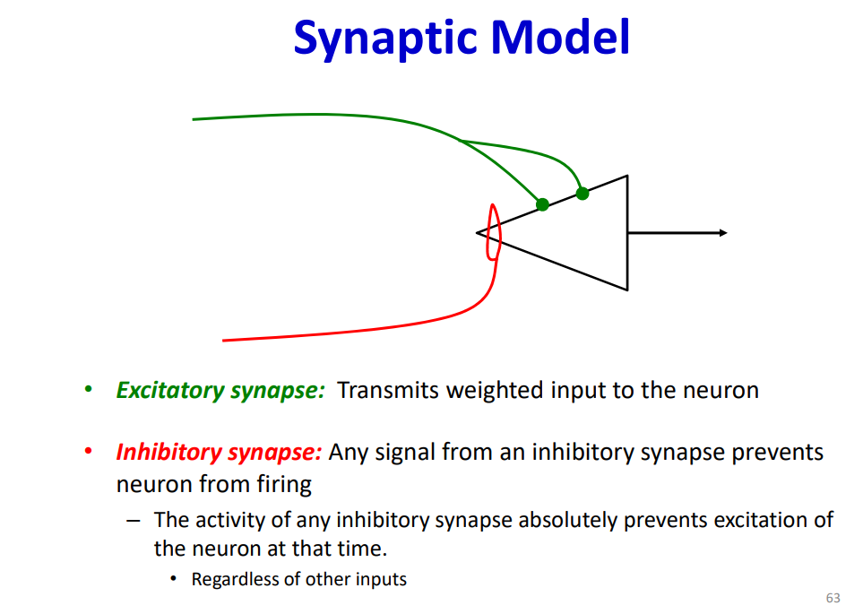
Key take away, not only does this model have the activation, it also has inhibition, which has veto power. I think this is omitted in the current incarnation of neural network?

2. 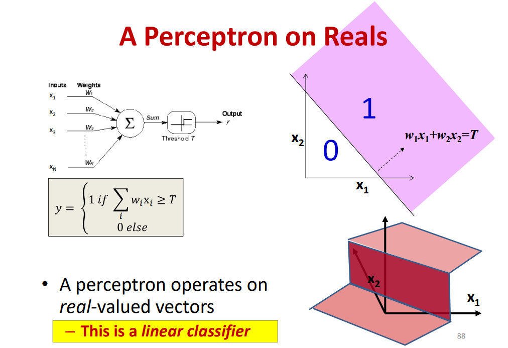
the visualization of hyperplane is actually quite helpful in terms of undersanding multi-layer perceptron as a universal function approximator

3. 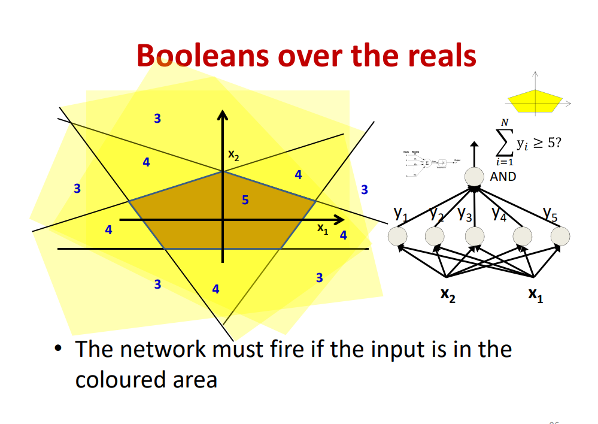 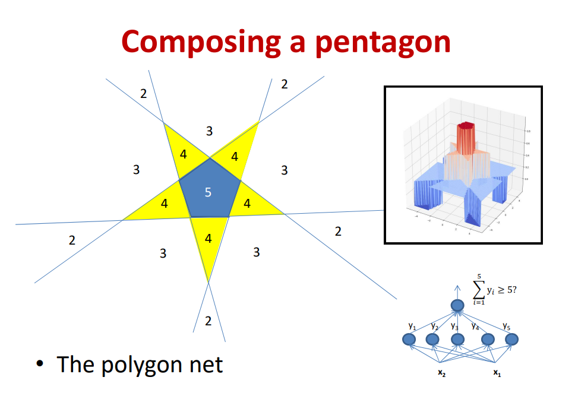
Every perceptron defines the boundary of an alphine plane, with multiple spetrons, you are effectively linearly combining the boundaries. With the addition of activation functioin, which is a gated value for perceptron, you also have differnet values for different regions of the plane.

If you define the desired region with threshod value of 5 then you effectively have a pentagon.This is how you constructor shape out of perceptron.

4. 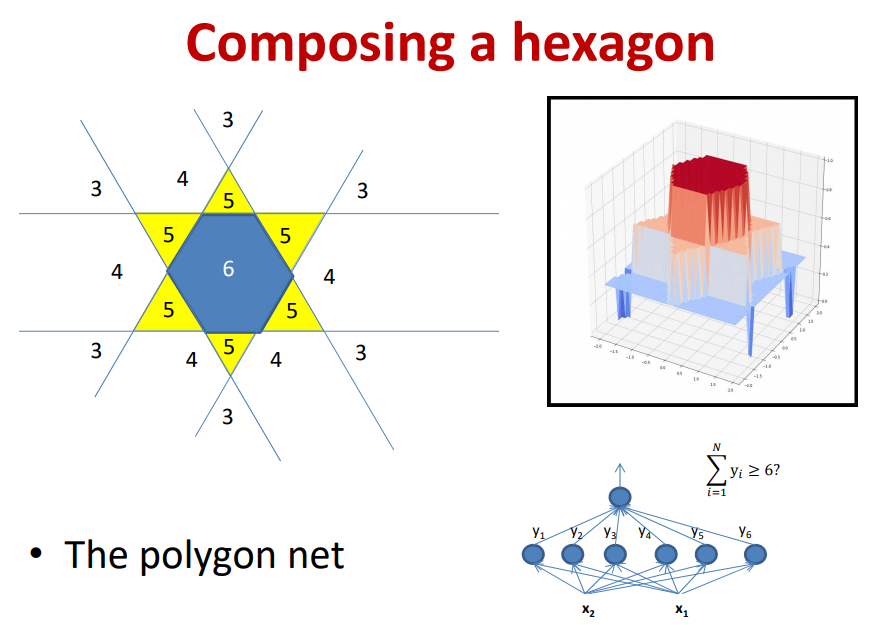 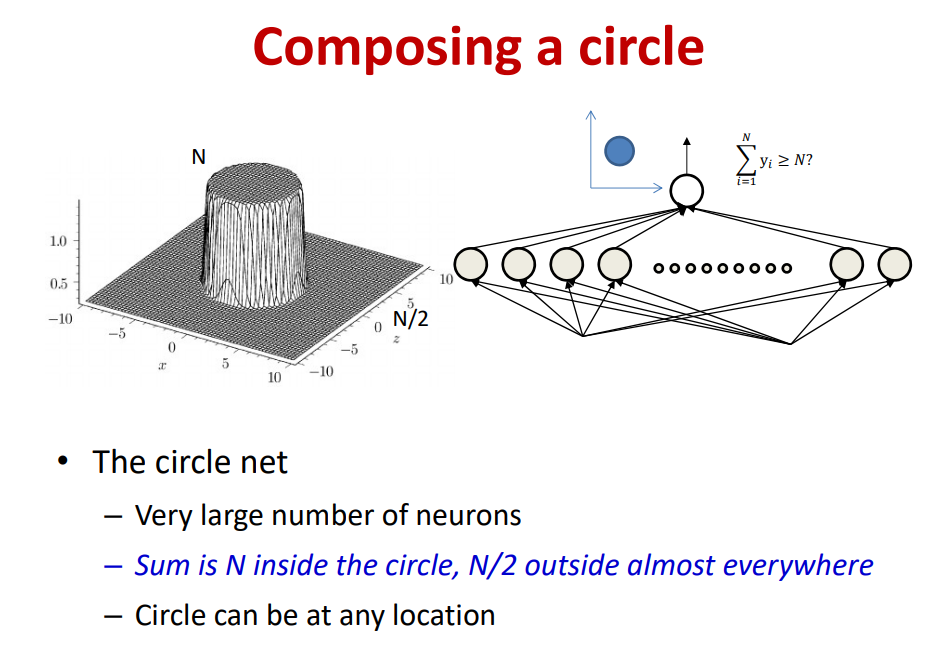 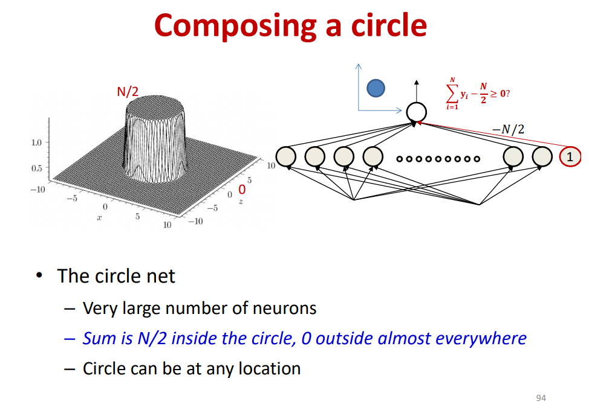
when you have infinite amount of perceptrons to define the boundaries, then you can define a cylinder, where inside the cylinder has value of N, out side of the cylinder have the value of N/2.  However, if you offset it with a bias, you have the cylinder height of N/2, out side height of 0. This cylinder is the basic building block for approximating other functions.

5. 
Not only can perceptrons be used to model any 2D shape, if you tile them up in temporal axis, you can use it to model any time series.

6. 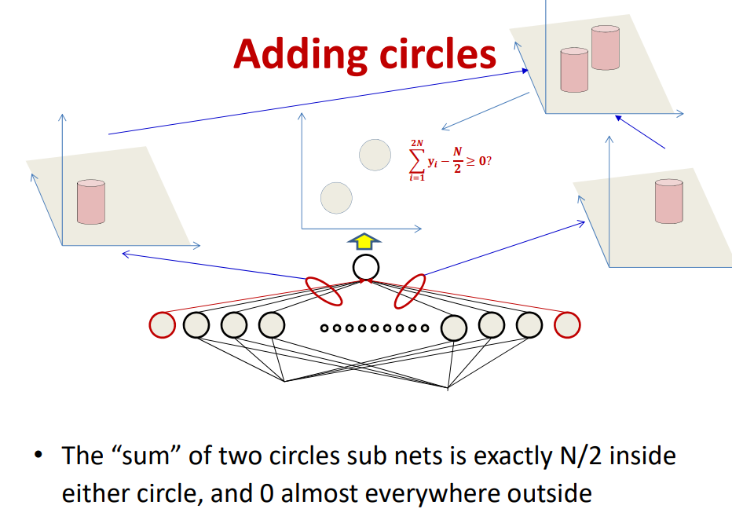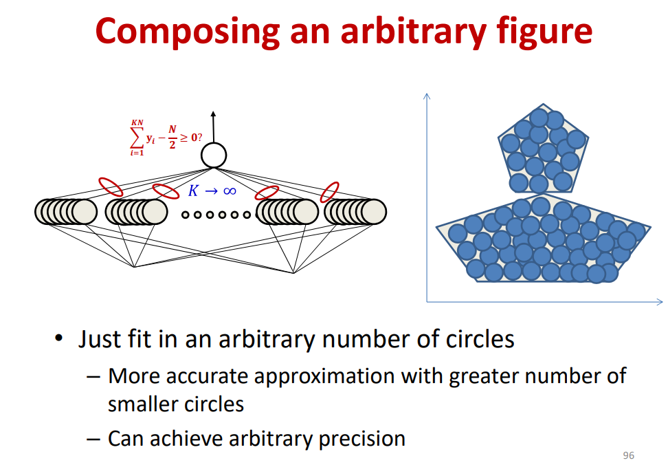 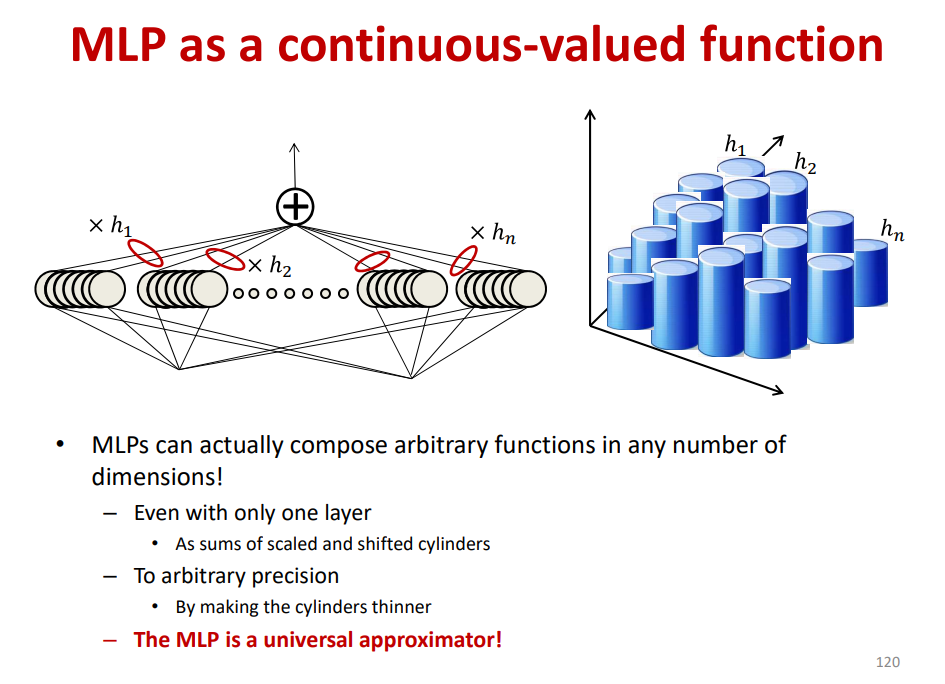

7. 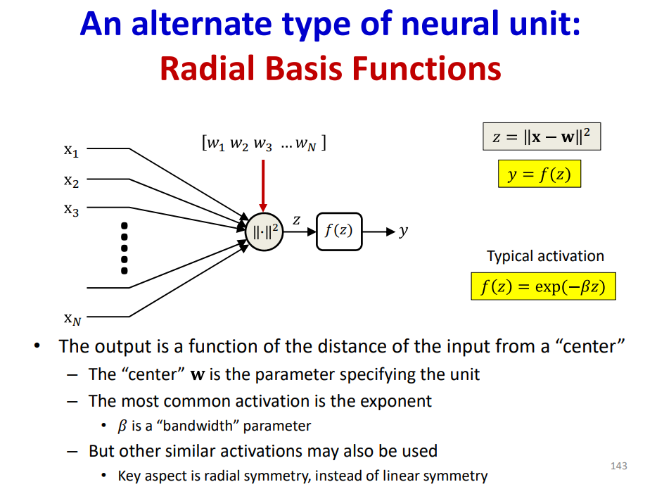 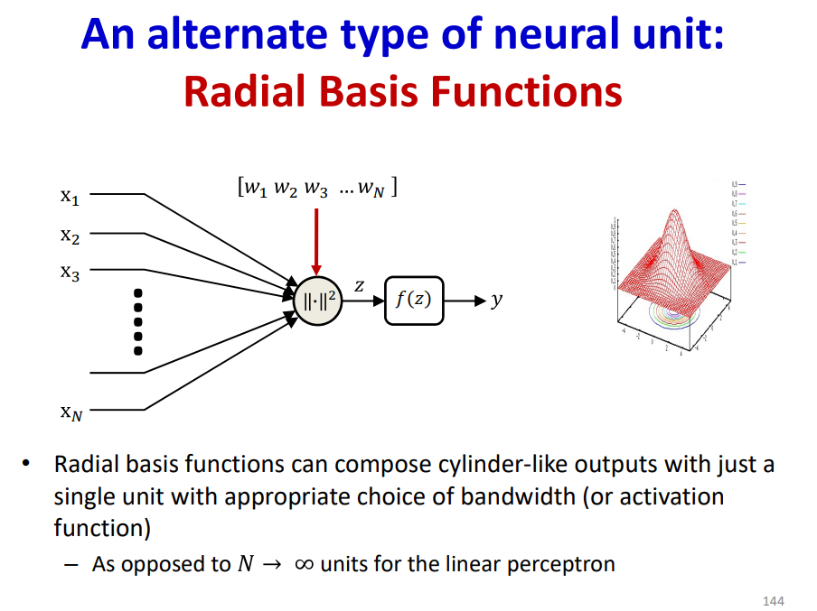 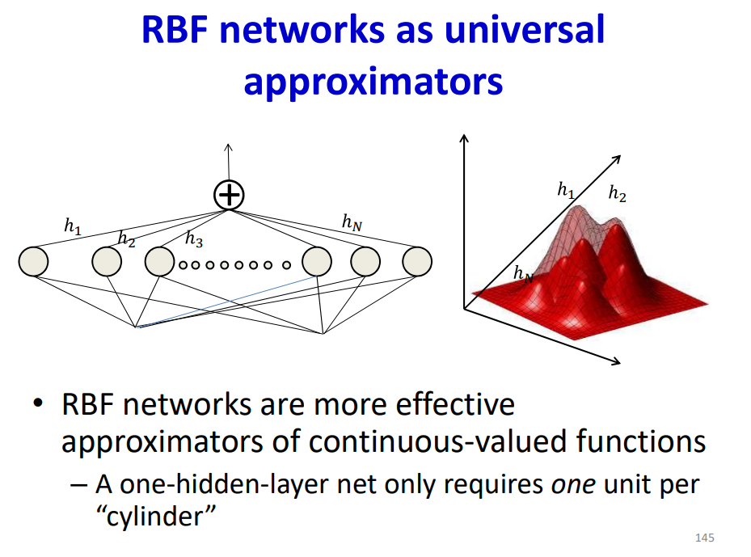

